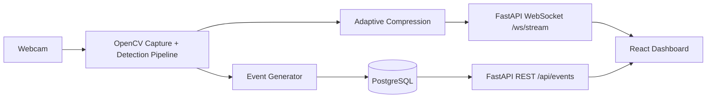

# Live Video Streaming Surveillance System with Real-Time Event Detection

A lightweight full-stack intelligent surveillance platform for research and industrial monitoring use cases. The system captures webcam frames on the backend, performs event detection (motion + optional YOLOv8 person detection), adaptively compresses frames, and streams them in real time to a modern React dashboard.

## Features

- **Real-time webcam streaming** via FastAPI WebSockets
- **Motion detection** using frame differencing (OpenCV)
- **Optional YOLOv8 person detection** with automatic fallback to motion-only mode
- **Adaptive compression**
  - Dynamically adjusts JPEG quality based on motion intensity
  - Dynamically scales frame resolution for bandwidth efficiency
- **Real-time alerts** in the dashboard
- **Timestamped event history** stored in PostgreSQL
- **REST API** for event retrieval
- **Connection status indicator** for stream health
- **Dockerized frontend + backend + PostgreSQL**
- **Modular architecture** for clean separation of concerns

## Architecture



## Project Structure

```text
.
├── backend
│   ├── app
│   │   ├── api
│   │   ├── db
│   │   ├── models
│   │   ├── schemas
│   │   └── services
│   ├── Dockerfile
│   └── requirements.txt
├── frontend
│   ├── src
│   │   ├── components
│   │   ├── context
│   │   ├── services
│   │   └── types
│   └── Dockerfile
└── docker-compose.yml
```

## Tech Stack

- **Backend:** FastAPI + SQLAlchemy (async) + OpenCV
- **Frontend:** React + TypeScript + Tailwind CSS
- **Streaming:** WebSockets
- **Database:** PostgreSQL
- **AI Detection:** YOLOv8 (optional)
- **Deployment:** Docker + Docker Compose

## Quick Start (Docker)

### 1) Clone and enter repository

```bash
git clone <repository-url>
cd Live-Video-Streaming-Surveillance-System-with-Real-Time-Event-Detection
```

### 2) Configure environment variables

```bash
cp backend/.env.example backend/.env
cp frontend/.env.example frontend/.env
```

### 3) Run the full stack

```bash
docker compose up --build
```

### 4) Open applications

- Frontend dashboard: `http://localhost:5173`
- Backend API docs: `http://localhost:8000/docs`
- Health endpoint: `http://localhost:8000/health`

> Note: For webcam passthrough in Docker, Linux hosts typically require `/dev/video0` availability and appropriate permissions.

## Local Development

### Backend

```bash
cd backend
python -m venv .venv
source .venv/bin/activate
pip install -r requirements.txt
cp .env.example .env
uvicorn app.main:app --reload --host 0.0.0.0 --port 8000
```

### Frontend

```bash
cd frontend
npm install
cp .env.example .env
npm run dev -- --host 0.0.0.0 --port 5173
```

## Environment Variables

### Backend (`backend/.env`)

- `APP_NAME` - service name
- `LOG_LEVEL` - logging level (`INFO`, `DEBUG`, ...)
- `DATABASE_URL` - SQLAlchemy async PostgreSQL URL
- `WEBSOCKET_FPS` - stream FPS target
- `WEBCAM_INDEX` - camera index for OpenCV
- `FRAME_WIDTH`, `FRAME_HEIGHT` - capture resolution
- `MIN_JPEG_QUALITY`, `MAX_JPEG_QUALITY` - adaptive JPEG quality range
- `MOTION_THRESHOLD` - detection threshold
- `ENABLE_YOLO` - enable YOLOv8 person detection (`true/false`)
- `YOLO_MODEL` - model path/name (e.g. `yolov8n.pt`)
- `ALLOWED_ORIGINS` - CORS origins list

### Frontend (`frontend/.env`)

- `VITE_BACKEND_URL` - base URL for backend HTTP/WebSocket

## API Endpoints

- `GET /health` - service health check
- `GET /api/events?limit=50` - recent event history
- `WS /ws/stream` - real-time JPEG frame stream + detection metadata

## Dashboard Sections

- **Live Video Feed**
- **Real-Time Alert Panel**
- **Event History Timeline**
- **Connection Status Indicator**

## Screenshots

Add your screenshots in this section after running the application:

- `docs/screenshots/dashboard-overview.png`
- `docs/screenshots/alerts-panel.png`
- `docs/screenshots/event-history.png`

## Notes on Detection Pipeline

1. Frame captured from webcam
2. Motion score calculated with grayscale differencing + thresholding
3. Optional YOLOv8 inference for person detection
4. Event generated when:
   - person confidence > 0.5, or
   - motion intensity exceeds threshold
5. Frame compressed adaptively based on motion intensity
6. Streamed to clients and events persisted in PostgreSQL

## Future Improvements

- Multi-camera stream support
- Redis pub/sub for horizontal scaling
- User authentication + role-based access
- Event snapshots/video clip storage
- Advanced analytics and charting

## License

This project is provided for educational and research purposes.
